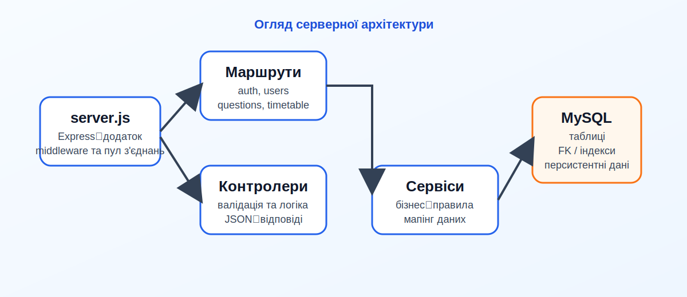
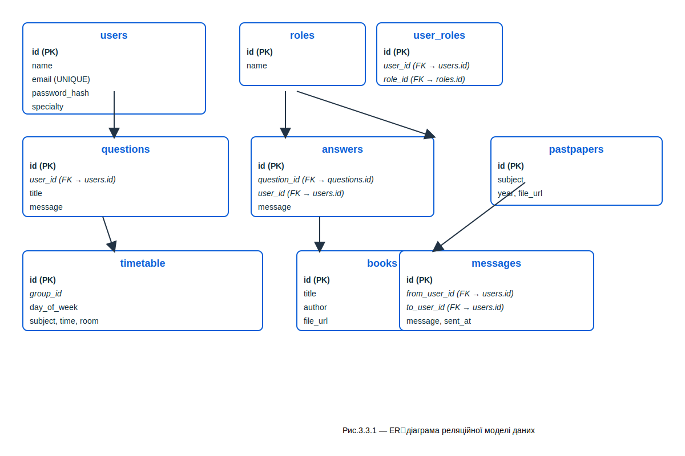

## 3. ПРОГРАМНА РЕАЛІЗАЦІЯ СИСТЕМИ

У цьому розділі описано практичну реалізацію веб‑платформи: клієнтську частину на React, серверну частину на Node.js та Express, структуру бази даних MySQL, а також реалізацію основних сценаріїв ти користувача, включно з профілем, розкладом, питаннями, чатом і допоміжними модулями.

### 3.1 Реалізація клієнтської частини на React

Клієнтська частина платформи реалізована як односторінковий застосунок (SPA) на базі React. Такий підхід дозволяє оновлювати дані без повного перезавантаження сторінки, забезпечує швидку навігацію між розділами та спрощує підтримку розширюваної компонентної структури. Основним завданням під час розробки інтерфейсу було створити зрозумілий і зручний для студентів та викладачів веб‑інтерфейс, у якому ключові функції доступні через декілька кліків.

Проєкт побудовано за компонентним принципом. У каталозі `client-side/src/Components` окремо винесено сторінки та функціональні блоки, зокре
ма навігацію, головну сторінку, профіль, питання, розклад, книжки, матеріали минулих років і модуль чату. Така структура робить код зрозумілим і дозволяє незалежно розвивати окремі частини системи. Для спільного стану використано Context API, наприклад `BooksContext`, `PastPaperContext` і `TimeTableContext`, що дає змогу передавати дані між вкладеними компонентами без надмірного прокидування пропсів.

Маршрутизація виконана за допомогою `react-router`. У системі розмежовано публічні сторінки та захищені маршрути, доступ до яких можливий лише після автентифікації. Це дає змогу контролювати видимість окремих розділів залежно від ролі користувача. Компонент `Navbar` динамічно змінює набір пунктів меню, тому студент, викладач і адміністратор бачать тільки ті функції, які їм дозволені.

Взаємодія з сервером реалізована через HTTP‑клієнт `axios` у файлі `client-side/src/api/apiClient.js`. Через нього централізовано виконуються запити до REST API, зокрема до маршрутів авторизації, користувачів, питань і розкладу. Використання інтерсепторів дозволяє автоматично додавати токен доступу до заголовка `Authorization`, а також обробляти типові помилки мережі та відповіді сервера в одному місці. Для сценаріїв реального часу, якщо вони активовані, передбачено підключення `socket.io-client`.

Окрему увагу приділено інтерфейсу користувача. Візуальні елементи стилізовано за допомогою SCSS, а стилі розбиті на тематичні файли у каталозі компонентів. Форми мають перевірку введення на клієнті, кнопки дій і повідомлення про помилки уніфіковані, а структура сторінок лишається простою і читабельною для демонстрації під час захисту.

Рис.3.1.1 — Головна сторінка клієнта.


Рис.3.1.2 — Інтерфейс профілю користувача.


Рис.3.1.3 — Приклад роботи HTTP‑клієнта та інтерсепторів.


Рис.3.1.4 — Демонстрація чату та обміну повідомленнями.


З технічного погляду клієнтська частина підтримує захист токенів, адаптивну верстку, lazy‑loading для великих сторінок та підготовку до подальшого тестування компонентів. У результаті отримано зручний та цілісний фронтенд, який коректно працює в зв’язці із сервером і може бути використаний як демонстраційна основа для навчальної платформи.

### 3.2 Реалізація серверної частини на Node.js та Express

Серверна частина побудована на Node.js із використанням фреймворку Express. Вона відповідає за обробку HTTP‑запитів, авторизацію, роботу з даними користувачів, питаннями, розкладом та іншими сутностями платформи. Така архітектура розділяє відповідальність між клієнтом і сервером: інтерфейс відповідає за відображення даних, а сервер — за логіку, перевірку прав доступу та доступ до БД.

Лістинг 3.2.1 — Базова конфігурація серверної частини.

```js
const app = express();

app.use(cors());
app.use(bodyParser.json());
app.use(bodyParser.urlencoded({ extended: true }));

app.use((req, res, next) => {
	console.log('[server] incoming', req.method, req.url, 'Authorization:', req.headers.authorization || '<none>');
	next();
});

const pool = mysql.createPool({
	host: process.env.DB_HOST,
	user: process.env.DB_USER,
	password: process.env.DB_PASSWORD,
	database: process.env.DB_NAME,
	port: process.env.DB_PORT,
	waitForConnections: true,
	connectionLimit: 10,
	queueLimit: 0
});
```

Цей фрагмент демонструє базову конфігурацію сервера: підключення middleware для JSON та URL‑encoded даних, логування вхідних запитів і створення пулу з’єднань із MySQL. Саме на цьому рівні формується ядро серверної логіки, яке далі використовується маршрутами та контролерами.

Рис.3.2.1 — Спрощена структура серверної архітектури.


У сервері створено окремі маршрути для основних доменів системи: auth, users, questions, timetable та допоміжних модулів. Для кожного маршруту визначено контролери, які приймають запити, перевіряють коректність вхідних даних, взаємодіють із сервісними функціями та повертають стандартизовану JSON‑відповідь. Завдяки цьому код залишається структурованим, а бізнес‑логіка не змішується з низькорівневими деталями обробки запитів.

Для контролю доступу застосовано JWT‑автентифікацію. Після успішного входу користувач отримує токен, який використовується для доступу до захищених ендпоінтів. Це рішення є зручним для SPA‑застосунку, оскільки не вимагає постійного перезавантаження сесії та добре масштабується в межах REST‑архітектури. Додатково на сервері реалізовано перевірку ролей, щоб адміністративні функції не були доступні звичайним користувачам.

Оскільки дані надходять від різних типів форм і клієнтських компонентів, на сервері застосовано валідацію вхідних параметрів та централізовану обробку помилок. Це дозволяє повертати зрозумілі повідомлення в разі некоректних даних, відсутніх полів або помилок доступу до бази. Також у серверній частині враховано CORS‑політику, щоб клієнт і сервер могли працювати у локальному середовищі розробки на різних портах.

Окремо варто відзначити готовність сервера до розширення. У разі необхідності до нього можна додавати нові маршрути, наприклад для сповіщень, вкладень, журналу активності або адміністративної аналітики, не змінюючи базову архітектуру застосунку.

### 3.3 Реалізація взаємодії з базою даних MySQL

Для зберігання даних у проєкті використано реляційну базу даних MySQL. Вибір цієї СУБД обумовлений тим, що платформа оперує взаємопов’язаними сутностями: користувачами, ролями, питаннями, відповідями, розкладом, навчальними матеріалами та журналами взаємодії. Реляційна модель забезпечує цілісність даних, контроль зв’язків між таблицями та зручність формування запитів для типових сценаріїв платформи.

Структура БД спроєктована за принципами нормалізації. Основні сутності винесено в окремі таблиці, між ними встановлено зовнішні ключі, а дублювання даних зведено до мінімуму. Це дає змогу уникати надлишковості, спрощує супровід і знижує ризик появи суперечливих записів. Для полів, які часто використовуються у фільтрації або пошуку, доцільно передбачити індекси, щоб пришвидшити роботу типових SQL‑запитів.

Узгодження серверної логіки та БД виконано через окремий шар доступу до даних. У ньому інкапсульовано SQL‑запити, вставку нових записів, отримання списків і оновлення існуючих сутностей. Такий підхід полегшує супровід коду: якщо змінюється структура таблиці або спосіб отримання даних, коригування вносяться в одному місці.


Для ключових операцій, таких як реєстрація користувача, створення питання або оновлення профілю, використовується послідовна логіка запису в таблиці з перевіркою результату. Це важливо для навчальної платформи, оскільки дані про доступи, розклад і контент мають зберігатися узгоджено та відновлювано. Окремо підготовлено SQL‑скрипт створення структури БД, який може бути використаний для швидкого розгортання системи на новому середовищі.

Рис.3.3.1 — ER‑діаграма реляційної моделі даних.


SQL‑скрипт для створення структури БД: `ReadmeAssets/sql/student_platform_schema.sql`.

### 3.4 Реалізація профілю користувача, розкладу та Q&A

Функціональні модулі профілю, розкладу та питань є центральними для взаємодії користувача з платформою. Саме через них студент і викладач отримують основну практичну цінність системи: перегляд і редагування власних даних, доступ до актуального розкладу та можливість ставити запитання, отримувати відповіді й повертатися до історії обговорень.

Модуль профілю дозволяє переглядати персональну інформацію користувача, редагувати базові дані та, за потреби, оновлювати фотографію. З точки зору інтерфейсу профіль побудовано так, щоб основні дії були доступні в одному екрані без зайвих переходів. У серверній частині ці зміни проходять через перевірку прав доступу, щоб кожен користувач міг змінювати лише власні дані.

Модуль розкладу реалізує перегляд занять за курсом або групою. Дані для нього зберігаються в окремих таблицях і передаються через API у форматі, зручному для відображення в табличному або картковому вигляді. У клієнтській частині розклад можна змінювати без повного перезавантаження сторінки, що робить роботу з ним швидкою та зручною.

Підсистема питань і відповідей (Q&A) призначена для організації внутрішньої комунікації між користувачами. Студент може створити питання, переглянути список уже створених тем, а викладач або інший користувач із відповідними правами — додати відповідь. Для цього передбачено окремі ендпоінти, таблиці та представлення у клієнтському інтерфейсі. Такий сценарій особливо важливий для навчального середовища, оскільки формує простір для обміну знаннями та допомоги всередині академічної спільноти.

#### Взаємодія з базою даних (коротко)

Нижче наведено приклади запитів та ендпоінтів, які ілюструють стандартні операції для модулів профілю, розкладу та Q&A.

Лістинг 3.4.1 — Отримання профілю користувача (SQL та приклад ендпоінта)
```sql
SELECT id, email, name, created_at
FROM users
WHERE id = ?;
```

Приклад ендпоінта (GET /api/users/me):
```js
// controllers/users.js (спрощено)
async function getMe(req, res) {
	const userId = req.user.id; // отримано з JWT
	const [rows] = await pool.query('SELECT id, email, name, created_at FROM users WHERE id = ?', [userId]);
	return res.json(rows[0]);
}
```

Лістинг 3.4.2 — Отримання розкладу для групи
```sql
SELECT t.id, t.course, t.day, t.time, t.room
FROM timetable t
WHERE t.course = ?
ORDER BY FIELD(t.day, 'Mon','Tue','Wed','Thu','Fri'), t.time;
```

Лістинг 3.4.3 — Створення питання (INSERT для Q&A)
```sql
INSERT INTO questions (user_id, title, body, created_at)
VALUES (?, ?, ?, NOW());
```

Ці фрагменти ілюструють типову послідовність: UI викликає ендпоінт → контролер виконує запит до шару доступу до даних → БД повертає результат або підтвердження вставки. Повний набір DDL і процедур див. у `ReadmeAssets/sql/student_platform_schema.sql`.

### 3.5 Реалізація месенджера та додаткових модулів

Окрім основних сторінок, у системі передбачено додаткові модулі, які підвищують практичну цінність платформи. До них належать месенджер, розділи з навчальними матеріалами, архіви минулих робіт і можливості модерації контенту. Саме ці компоненти роблять платформу не лише технічною демонстрацією, а повноцінним інструментом для повсякденної роботи студентської спільноти.

Месенджер реалізовано як окремий модуль для швидкого обміну повідомленнями між користувачами. У базовому варіанті він може працювати через звичайні HTTP‑запити, а за необхідності доповнюватися механізмом реального часу на базі WebSocket або `socket.io`. Логіка цього модуля дозволяє обмінюватися короткими повідомленнями, зберігати історію діалогів та підтримувати контекст розмови між учасниками.

Додаткові навчальні модулі включають розділи з підручниками, методичними матеріалами та файлами минулих робіт. Вони допомагають користувачам швидко знаходити потрібні джерела, а адміністратору — керувати наповненням системи. Для цих розділів доцільно використовувати єдині правила відображення контенту, фільтрацію за категоріями та спільний підхід до завантаження/перегляду даних.

До допоміжних функцій також належать адміністративні інструменти: керування користувачами, контроль доступу, модерація повідомлень і контенту, а також підготовка системи до демонстраційного запуску. Усі ці частини не перевантажують основний інтерфейс, але суттєво доповнюють можливості платформи та демонструють її придатність до подальшого розвитку.

Підсумовуючи, програмна реалізація системи охоплює повний цикл взаємодії: від клієнтського інтерфейсу та серверної логіки до роботи з базою даних і допоміжними модулями. Така структура робить проєкт цілісним, логічно завершеним і придатним для демонстрації як практична веб‑платформа для студентської соціальної взаємодії.

